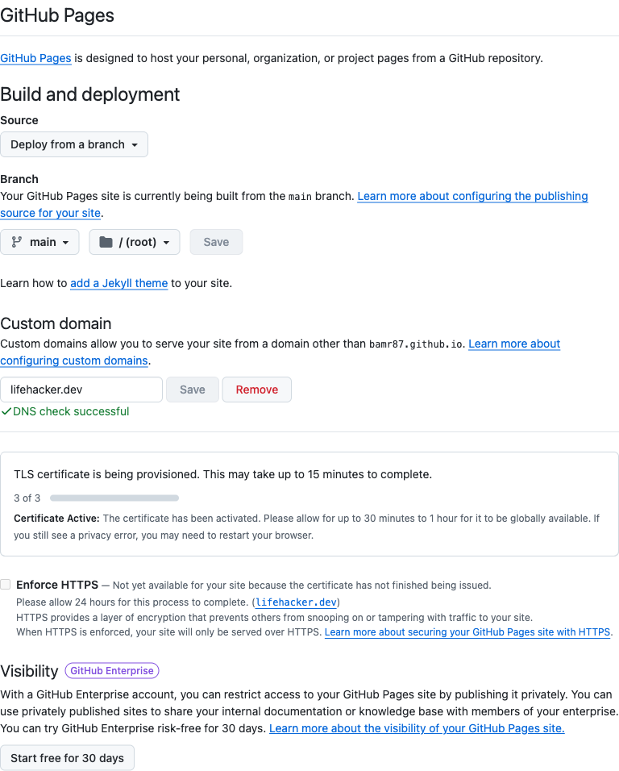
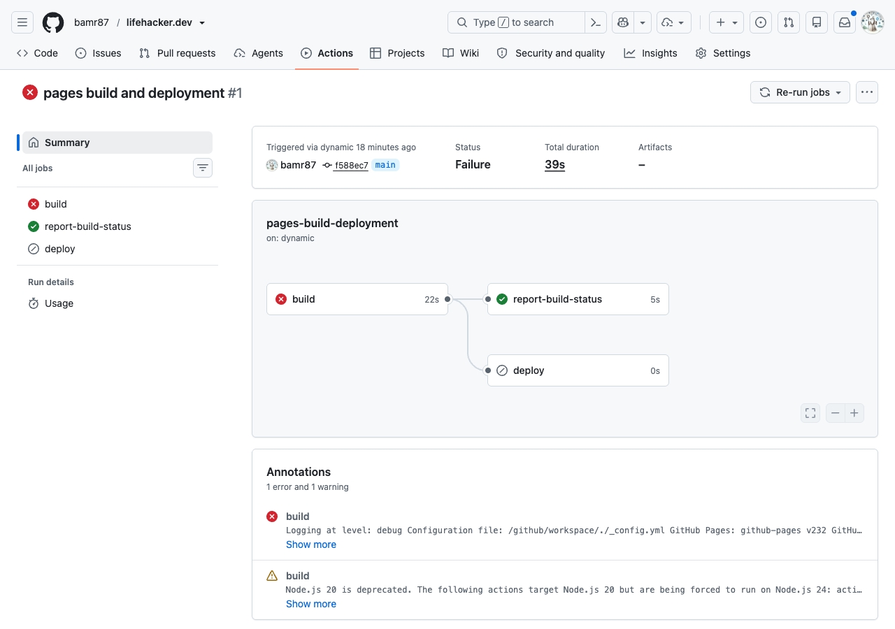
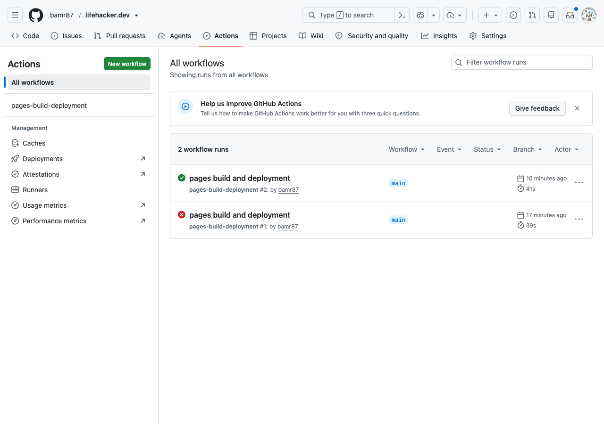
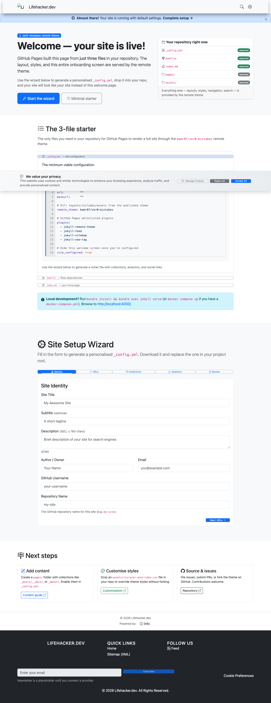

# Deploy a Jekyll site to GitHub Pages on a custom domain (lifehacker.dev)

This is a complete, reproducible walkthrough for publishing a Jekyll site to GitHub Pages at your own apex domain — `lifehacker.dev` — using the [`zer0-mistakes`](https://github.com/bamr87/zer0-mistakes) remote theme, DNS managed in Squarespace, and HTTPS via GitHub's free automatic certificate. You write three small files, let GitHub Pages build the site for you (no GitHub Actions workflow to maintain), point four DNS records at GitHub, and finish with a live, HTTPS-only site. It also documents a real build failure we hit and the one-line fix, because that's the part most guides skip.

> **Before you begin: substitute your own values.** This walkthrough uses one specific identity and machine throughout. Wherever you see these literals, swap in your own:
>
> | Literal in this tutorial | Placeholder | What it is |
> | --- | --- | --- |
> | `bamr87` | `<GH_USER>` | your GitHub username |
> | `lifehacker.dev` | `<DOMAIN>` | the apex domain you own |
> | `/Users/bamr87/github/lifehacker.dev` | `<PROJECT_DIR>` | your local project folder |
>
> Two values are **derived from your GitHub username, not your domain**: the verification TXT record host is `_github-pages-challenge-<GH_USER>` (e.g. `_github-pages-challenge-bamr87`), and the `www` CNAME target is `<GH_USER>.github.io` (e.g. `bamr87.github.io`). If you copy the commands verbatim without substituting, you'll push to `bamr87`'s namespace (which isn't yours) and add a challenge record with the wrong username. Substitute first.

## What you end up with

- A **public** GitHub repo, `bamr87/lifehacker.dev`, holding a tiny remote-theme starter (just `_config.yml`, `Gemfile`, `index.md`, plus `CNAME` and `.gitignore`).
- A Jekyll site **built by GitHub Pages itself** (the `github-pages` gem), styled by the `zer0-mistakes` remote theme that's pulled in at build time — nothing to vendor or download.
- The site served at **https://lifehacker.dev** with **automatic HTTPS** (a free Let's Encrypt certificate GitHub provisions and renews for you).
- **`www.lifehacker.dev` → `lifehacker.dev`** redirection, so both hostnames resolve to one canonical apex URL.
- **DNS managed at Squarespace** (the registrar that now hosts former Google Domains zones) with four `A` records, four `AAAA` records, a `www` `CNAME`, and GitHub's verification `TXT` record.

## How it works

A few moving parts cooperate here; understanding them makes the troubleshooting later obvious.

- **Remote theme, pulled at build time.** `_config.yml` sets `remote_theme: bamr87/zer0-mistakes`. The `jekyll-remote-theme` plugin fetches that repo's layouts, includes, Sass, and assets during the build, so your repo stays tiny. Crucially, a remote theme contributes *only* those files — **any plugin its layouts call must be enabled in your own `_config.yml`** (this is exactly what bites us in the troubleshooting step). It also does **not** copy the theme's `_config.yml` or `_data/` directory, so anything the theme's includes read from `site.data` (for example `site.data.navigation`) is empty until you add your own — the build still succeeds and the navigation degrades gracefully.
- **GitHub's built-in Jekyll build — no Actions file needed.** Setting Pages' source to "Deploy from a branch" runs GitHub's legacy Jekyll builder. The `github-pages` gem bundles a fixed, whitelisted set of plugins (including `jekyll-remote-theme` and `jekyll-include-cache`), so you don't write or maintain a `.github/workflows/*.yml` file.
- **`CNAME` selects the custom domain.** The repo's `CNAME` file contains one line — `lifehacker.dev`. Jekyll copies it into the build output, and GitHub Pages reads it to set the custom domain automatically.
- **DNS points the apex at GitHub; `www` redirects.** Four `A` records (and four matching `AAAA` records) point the apex `@` at GitHub Pages' anycast IPs, and a `www` `CNAME` to `bamr87.github.io` lets GitHub 301-redirect `www` to the apex. An optional `TXT` challenge record verifies you own the domain.
- **`.dev` forces HTTPS; GitHub issues the cert.** The `.dev` TLD is on the HSTS preload list, so browsers refuse plain `http`. Once DNS resolves, GitHub automatically issues a Let's Encrypt TLS certificate for `lifehacker.dev`, after which you enable "Enforce HTTPS".

## Table of contents

1. [Prerequisites](#prerequisites)
2. [Step 1 — Scaffold the site (3 files + `CNAME`)](#step-1--scaffold-the-site-3-files--cname)
3. [Step 2 — Create the GitHub repo and push](#step-2--create-the-github-repo-and-push)
4. [Step 3 — Enable GitHub Pages and set the custom domain](#step-3--enable-github-pages-and-set-the-custom-domain)
5. [Step 4 — Point DNS at GitHub (Squarespace)](#step-4--point-dns-at-github-squarespace)
6. [Step 5 — When the first build fails: the `include_cached` fix](#step-5--when-the-first-build-fails-the-include_cached-fix)
7. [Step 6 — Verify and enforce HTTPS](#step-6--verify-and-enforce-https)
8. [Reference and going further](#reference-and-going-further)

## Prerequisites

Before you start, make sure you have the following. The whole point of this tutorial is that GitHub builds the site for you, so the local toolchain is minimal — **you do not need Ruby or Jekyll installed** for the GitHub-built path.

### Required

- **A GitHub account.** This walkthrough uses `bamr87` (your `<GH_USER>`). The repo (`bamr87/lifehacker.dev`) will be **public** so that GitHub Pages serves it for free.
- **A domain you control in Squarespace.** The worked example is the apex domain `lifehacker.dev`, registered and DNS-managed in Squarespace (Squarespace acquired Google Domains, so the nameservers are `ns-cloud-*.googledomains.com`). You'll edit DNS under **Squarespace → Domains → lifehacker.dev → DNS → DNS Settings → Custom records**.

  > **Heads-up on `.dev`:** the `.dev` TLD is on the browser HSTS preload list, so it is **HTTPS-only** — plain `http://lifehacker.dev` will be refused by browsers. That's fine here, because GitHub Pages provisions a free TLS certificate automatically. If your domain is a different TLD the steps are identical.

- **git installed.** Check it:

  ```bash
  git --version
  ```

  ```text
  git version 2.52.0   # example output — your version may differ; any recent 2.x is fine
  ```

### Optional but recommended

- **GitHub CLI (`gh`), authenticated with `repo` scope.** This lets you create the repo and enable Pages from the terminal in one command instead of clicking through the web UI. Verify and confirm your auth scopes:

  ```bash
  gh --version
  gh auth status
  ```

  ```text
  gh version 2.86.0   # example output — your version may differ
  ```

  If `gh auth status` doesn't list the `repo` scope, run `gh auth login` (or `gh auth refresh -s repo`) before continuing. Every `gh` step in this tutorial has a click-through web-UI equivalent, so you can skip `gh` entirely if you prefer.

- **Docker, only if you want a local preview.** The `zer0-mistakes` theme ships a Docker dev setup, so you can render `lifehacker.dev` at `http://localhost:4000` without installing Ruby. Check it:

  ```bash
  docker --version
  ```

  ```text
  Docker version 29.2.1   # example output — your version may differ
  ```

  Local preview is covered in *Going further* at the end — it is entirely optional, because GitHub builds and serves the real site for you.

> **What you explicitly do _not_ need:** Ruby, Bundler, or a local Jekyll install for the GitHub-built path. The site is built by GitHub Pages' built-in Jekyll using the `github-pages` gem on GitHub's servers, and the `zer0-mistakes` theme is pulled in at build time via `remote_theme` — there is nothing to download or compile on your machine. (The `bundle exec jekyll serve` local-preview path *does* require a local Ruby + Bundler — see *Going further*.)

## Step 1 — Scaffold the site (3 files + `CNAME`)

A GitHub Pages site that uses a **remote theme** needs almost nothing of its own — the theme supplies every layout, include, and stylesheet at build time. You'll create just five files: three that define the site, one that claims the domain, and a `.gitignore` to keep build junk out of git.

Create the project directory and drop in these files:

```text
lifehacker.dev/
├── _config.yml      # site settings + remote theme + plugins
├── Gemfile          # gems for local builds (GitHub Pages ignores this)
├── index.md         # the one and only page
├── CNAME            # the custom domain GitHub Pages will serve at
└── .gitignore       # keep _site/ and friends out of git
```

```bash
mkdir lifehacker.dev && cd lifehacker.dev
```

### `_config.yml` — the heart of it

This is the only file with real configuration. Everything else hangs off it. We start with a **minimal plugin list** on purpose — just the four plugins the bare starter ships with. This is exactly what the real first commit used, and it's what sets up the instructive build failure in Step 5 (and its one-line fix).

```yaml
title:        "Lifehacker.dev"
description:  "Tips, tools, and experiments — rendered by the zer0-mistakes remote theme."
url:          "https://lifehacker.dev"
remote_theme: bamr87/zer0-mistakes
plugins:
  - jekyll-remote-theme
  - jekyll-feed
  - jekyll-sitemap
  - jekyll-seo-tag
site_configured: false   # show the welcome wizard until you flip this to true
```

What each key does:

- **`url`** — the canonical site address, `https://lifehacker.dev`. `jekyll-seo-tag` and `jekyll-sitemap` use this to build absolute URLs in `<head>` and `sitemap.xml`. Set it to your apex domain, with `https://`.
- **`remote_theme: bamr87/zer0-mistakes`** — pulls the [zer0-mistakes](https://github.com/bamr87/zer0-mistakes) theme (a Bootstrap 5 Jekyll theme) directly from its GitHub repo at build time. There's nothing to download or vendor; GitHub Pages fetches it for you. The theme contributes *only* layouts, includes, Sass, and assets — not plugins, and not its own `_config.yml` or `_data/`.
- **`plugins`** — the Jekyll plugins to load. These four are the standard set (feed, sitemap, SEO, remote-theme). Notice what's **missing**: the theme's layouts also need `jekyll-include-cache`, which isn't listed yet. That omission is deliberate — it's what makes the first build fail in Step 5, where we add it as the one-line fix.
- **`site_configured: false`** — a zer0-mistakes flag. While it's `false`, the home page renders the theme's **welcome / onboarding wizard** instead of your real content. Flip it to `true` once you've added pages and posts of your own. (The real theme's own `_config.yml` ships `site_configured: true`; we set `false` here so the wizard appears on the fresh site.)

> A remote theme only ships layouts/includes/Sass/assets. **Any plugin the theme's layouts depend on must be enabled in *your* `plugins:` list** — the theme can't enable it for you. The starter above is intentionally missing one such plugin so you can see the failure and fix in Step 5.

### `Gemfile` — for local builds only

GitHub Pages builds with its own pinned gem set and **ignores your `Gemfile`'s versions**, but you still want one so `bundle exec jekyll serve` works locally **if you have Ruby and Bundler installed** (the GitHub-built path does not require them).

```ruby
source "https://rubygems.org"
gem "github-pages", group: :jekyll_plugins
gem "jekyll-remote-theme"
gem "webrick", "~> 1.7"
```

The `github-pages` gem pulls in Jekyll plus the exact whitelisted plugins (and versions) that GitHub Pages runs, so local builds match production. `webrick` is needed because Ruby 3.0+ no longer bundles it.

### `index.md` — keep it minimal

Your only page. The theme's `welcome` layout does all the visual work, so the body is a single heading.

```markdown
---
layout: welcome
title: Home
---

# Welcome to Lifehacker.dev
```

The `title: Home` front matter is what produces the `<title>Home | Lifehacker.dev</title>` you'll verify at the end.

> **Where does `layout: welcome` come from?** Layout names are just the filenames (minus `.html`) in the theme's `_layouts/` directory. You can browse the valid names at [bamr87/zer0-mistakes/tree/main/_layouts](https://github.com/bamr87/zer0-mistakes/tree/main/_layouts) — `welcome`, `home`, `landing`, and `default` are all valid choices. We use `welcome` to get the onboarding wizard on the first page.

### `CNAME` — claims the custom domain

One line, no `http://`, no trailing slash — just the apex domain:

```text
lifehacker.dev
```

Jekyll copies this file verbatim into the build output, and **GitHub Pages reads it to set the site's custom domain** (it'll even auto-populate the *Custom domain* field in Settings for you). This is what makes the site serve at `lifehacker.dev` instead of `bamr87.github.io/lifehacker.dev`.

### `.gitignore` — ignore build artifacts

Nothing here belongs in version control; it's all generated locally.

```text
_site/
.jekyll-cache/
.jekyll-metadata
.sass-cache/
vendor/
.bundle/
Gemfile.lock
```

> We git-ignore `Gemfile.lock` on purpose: GitHub Pages resolves its own dependency versions, so a committed lock file from your machine can drift from what Pages actually runs. For a standalone Jekyll app (not Pages) you'd usually commit it instead.

**Success looks like:** running `ls -A` shows exactly these five entries — `_config.yml`, `Gemfile`, `index.md`, `CNAME`, `.gitignore` — and `cat CNAME` prints `lifehacker.dev`. Once deployed, the home page will render the theme's **welcome wizard** (not a blank page) — that, plus a barebones default navigation (because a remote theme doesn't copy the theme's `_data/navigation.yml`), is the correct "success" state for a fresh site, not a bug. That's the entire site; on to putting it in a repo.

## Step 2 — Create the GitHub repo and push

Your starter files are ready locally at `/Users/bamr87/github/lifehacker.dev` (your `<PROJECT_DIR>`). Now turn that folder into a Git repo and publish it to GitHub as a **public** repo named `lifehacker.dev`. We make it public because GitHub Pages on a custom domain is free for public repos and needs no extra setup.

The fastest path uses the [GitHub CLI](https://cli.github.com) (`gh`), which initializes the repo, creates it on GitHub, and pushes in a few commands.

```bash
cd /Users/bamr87/github/lifehacker.dev

# Initialize a repo with main as the default branch
git init -b main

# Stage and commit every starter file (_config.yml, Gemfile, index.md, CNAME, .gitignore)
git add -A
git commit -m "Initial commit: zer0-mistakes remote-theme starter for lifehacker.dev"

# Create the public repo on GitHub from this folder and push in one shot
gh repo create bamr87/lifehacker.dev \
  --public \
  --source /Users/bamr87/github/lifehacker.dev \
  --remote origin \
  --push \
  --description "Jekyll site on GitHub Pages at the custom apex domain lifehacker.dev, using the zer0-mistakes remote theme"
```

**What success looks like:** `gh` prints the new repo URL (`https://github.com/bamr87/lifehacker.dev`), sets your `origin` remote, and pushes `main`. Confirm with:

```bash
git remote -v
# origin  https://github.com/bamr87/lifehacker.dev.git (fetch)
# origin  https://github.com/bamr87/lifehacker.dev.git (push)
```

> The `--source` flag points at the folder to publish — here the absolute path `/Users/bamr87/github/lifehacker.dev`. You can also pass `--source .` to use the current directory, but then make sure you're actually in `<PROJECT_DIR>` when you run it. (If you haven't authenticated `gh` yet, run `gh auth login` once first — see *Prerequisites*.)

### No `gh` CLI? Use the GitHub web UI

1. Go to [github.com/new](https://github.com/new).
2. Set **Owner** to `bamr87` and **Repository name** to `lifehacker.dev`.
3. Choose **Public**.
4. Leave "Add a README", ".gitignore", and "license" **unchecked** — creating an empty repo avoids a merge conflict on your first push from the local folder.
5. Click **Create repository**, then run the commands GitHub shows under *"…or push an existing repository from the command line"*:

```bash
cd /Users/bamr87/github/lifehacker.dev
git init -b main
git add -A
git commit -m "Initial commit: zer0-mistakes remote-theme starter for lifehacker.dev"
git remote add origin https://github.com/bamr87/lifehacker.dev.git
git push -u origin main
```

> Either path lands you in the same place: a public `bamr87/lifehacker.dev` repo on GitHub with your five starter files on `main`. Next we'll point GitHub Pages at this branch.

## Step 3 — Enable GitHub Pages and set the custom domain

Now point GitHub Pages at your code. Because the repo already contains a `CNAME` file (a single line, `lifehacker.dev`), GitHub will recognize the custom domain automatically — there's nothing extra to download and **no GitHub Actions workflow file to write**. The classic built-in Jekyll build (GitHub calls this `build_type: legacy`) runs the `github-pages` gem for you, and that gem already bundles `jekyll-remote-theme` plus the whitelisted plugins your theme needs.

### 3a. Turn on Pages from the `main` branch

In your browser, go to the **repository's Settings → Pages → Build and deployment**. Set:

- **Source** = `Deploy from a branch`
- **Branch** = `main`
- **Folder** = `/ (root)`

Click **Save**.

Prefer the terminal? The CLI equivalent does exactly the same thing:

```bash
gh api -X POST repos/bamr87/lifehacker.dev/pages \
  -f 'source[branch]=main' \
  -f 'source[path]=/'
```

> The `/ (root)` folder is correct here — your `_config.yml`, `index.md`, and `CNAME` all live at the repo root, not in a `/docs` subfolder.

### 3b. Confirm (or set) the custom domain

Scroll to **Settings → Pages → Custom domain**. Because `CNAME` is committed to the repo, GitHub auto-populates this field with `lifehacker.dev`. If for some reason it's blank, type `lifehacker.dev` and click **Save** — GitHub will write/refresh the `CNAME` file to match.


*The Pages settings after everything is wired up: source on `main` at root, custom domain `lifehacker.dev`, a green "DNS check successful," and an active TLS certificate.*

### What success looks like

Right after saving, GitHub kicks off the first build. Because the source is "Deploy from a branch," this is the **legacy "pages build and deployment"** workflow — watch it under the **Actions** tab — and GitHub starts a **DNS check** on `lifehacker.dev`. Until you add the DNS records in Step 4, that check will show an error like "Domain does not resolve to the GitHub Pages server" — that's expected. Once DNS is in place and propagates, the panel flips to **"DNS check successful,"** and GitHub then **automatically provisions a free Let's Encrypt TLS certificate** for `lifehacker.dev` (a few minutes, occasionally up to ~24h — no action required). When the certificate reads **Certificate Active**, tick **Enforce HTTPS**.

> Don't panic if the **Custom domain** field briefly clears itself or the DNS check fails immediately after enabling Pages — both resolve once the records from the next step propagate.

## Step 4 — Point DNS at GitHub (Squarespace)

GitHub Pages is serving your site, but `lifehacker.dev` still resolves to nowhere. Now you tell DNS to send the apex domain to GitHub's servers. Because Squarespace acquired Google Domains, your domain's nameservers are `ns-cloud-*.googledomains.com` but you manage everything inside the Squarespace UI.

### 4.1 Open the Custom records editor

In Squarespace, go to **Domains → lifehacker.dev → DNS → DNS Settings**, then scroll to **Custom records**. This is where you'll add the records that point the apex (`@`) and `www` at GitHub Pages.

> Squarespace inherits Google Domains' login flow, so before it lets you touch DNS it pops a **Google re-authentication** dialog — *"Verify to continue as &lt;you&gt; — Login with Google to continue."* It can reappear several times during a single editing session. Just re-auth and keep going; it's expected, not an error.

### 4.2 Add the required records

You need four `A` records (GitHub Pages' apex IPv4 addresses), one `www` `CNAME`, and — optionally but recommended — four `AAAA` records for IPv6. These are the records that actually make the site resolve:

| Type  | Name (Host) | Data / Value          | Required?              |
| ----- | ----------- | --------------------- | ---------------------- |
| A     | `@`         | `185.199.108.153`     | required               |
| A     | `@`         | `185.199.109.153`     | required               |
| A     | `@`         | `185.199.110.153`     | required               |
| A     | `@`         | `185.199.111.153`     | required               |
| CNAME | `www`       | `bamr87.github.io`    | required (for `www`)   |
| AAAA  | `@`         | `2606:50c0:8000::153` | optional, recommended  |
| AAAA  | `@`         | `2606:50c0:8001::153` | optional, recommended  |
| AAAA  | `@`         | `2606:50c0:8002::153` | optional, recommended  |
| AAAA  | `@`         | `2606:50c0:8003::153` | optional, recommended  |

The four `A` records are how an apex domain reaches GitHub Pages (you can't `CNAME` a bare apex). The `www` `CNAME` to `bamr87.github.io` lets `www.lifehacker.dev` redirect to the apex. In Squarespace, the apex is always written as **`@`**.

> **Verify these IPs against current docs before adding.** The four IPv4 addresses (`185.199.108–111.153`) and the four IPv6 addresses are GitHub Pages' published apex addresses, but published IPs can change. Confirm the current set in GitHub's [Managing a custom domain for your GitHub Pages site](https://docs.github.com/en/pages/configuring-a-custom-domain-for-your-github-pages-site/managing-a-custom-domain-for-your-github-pages-site) docs (the canonical source for both the `A` and `AAAA` records) before pasting. A stale `AAAA` record silently breaks IPv6-only visitors.

To add each one, click **Add record** under Custom records and fill in the fields. Using the first `AAAA` record as the example:

- **Type:** `AAAA`
- **Name:** `@`
- **Priority:** leave blank (only `MX`/`SRV` use it)
- **TTL:** the default (e.g. 1 hour / 3600s) is fine
- **Data / "IPv6 address":** `2606:50c0:8000::153`

Then **Save**, and repeat for the remaining records. (For the `A` records the value field is labeled "IPv4 address"; for `CNAME` it's "domain name.")


*The complete custom-records set for lifehacker.dev in Squarespace: the four apex `A` records, the GitHub verification `TXT` record, the `www` CNAME, and the four `AAAA` (IPv6) records.*

> The four `AAAA`/IPv6 records are **optional** — the site resolves and gets HTTPS with just the `A` records and the `www` `CNAME` — but they're recommended so visitors on IPv6-only networks reach you directly.

### 4.3 (Optional, recommended) Verify the domain with GitHub (anti-takeover)

Domain verification is **optional but recommended** — your site resolves and gets HTTPS with only the `A`/`AAAA`/`CNAME` records above. What verification adds is anti-takeover hardening: it proves you own `lifehacker.dev` so that **no one else's GitHub account can claim it** if your DNS ever points at GitHub while your repo's custom domain is unset. Without it, a dangling DNS record is a classic subdomain/domain-takeover vector.

Note that this lives on a **different Settings page** than Step 3. The repo's Pages settings are at the repository's **Settings → Pages**; domain verification is at your **account/organization** level — **github.com/settings/pages** for a personal account (or your organization's settings for an org). Go there, click **Add a domain**, enter `lifehacker.dev`, and GitHub gives you a unique `TXT` record to add:

```text
Type:  TXT
Name:  _github-pages-challenge-bamr87   # host is derived from your GitHub username, not the domain
Data:  <token>                          # GitHub generates this; keep it as-is, do not share it publicly
```

Add it in Squarespace exactly like the others (Type `TXT`, Name `_github-pages-challenge-bamr87`, paste the token into Data), **Save**, then click **Verify** back in GitHub.

> The `Name` GitHub shows you may include the full `_github-pages-challenge-bamr87.lifehacker.dev`. In Squarespace, enter only the host portion — `_github-pages-challenge-bamr87` — because the domain is appended automatically. Remember the host uses your **GitHub username** (`<GH_USER>`), not your domain.

### What success looks like

Once saved, DNS changes need to **propagate** — usually a few minutes, but it can take up to ~24 hours depending on TTL and resolver caching. When it's done, the apex and `www` resolve to GitHub:

```bash
dig +short lifehacker.dev
# 185.199.108.153
# 185.199.109.153
# 185.199.110.153
# 185.199.111.153

dig +short www.lifehacker.dev
# bamr87.github.io.
# (followed by the four IPs)
```

Back on the repo's **Settings → Pages**, the Custom domain field should flip to **"DNS check successful,"** and (if you did the optional step) GitHub's **Verify domains** screen should show `lifehacker.dev` as verified. Give it a little time before worrying — DNS propagation is the slow part. (We re-run these `dig` checks in detail in Step 6.)

## Step 5 — When the first build fails: the `include_cached` fix

Push the starter, enable Pages... and watch the first build go red. This is the single most common way a remote-theme Pages site fails on the first try, so it's worth slowing down for. The good news: the fix is one line. (This is exactly why Step 1's `plugins:` list had only four entries — so you'd reproduce this failure rather than skip past the lesson.)

### 5.1 — Read the failure

The very first **pages build and deployment** run (run #1, ~39s, on commit `f588ec7`) failed. Open the **Actions** tab of `bamr87/lifehacker.dev`, click the failed **pages build and deployment** run, then open the failed run's log, and you'll find this:

```text
Liquid Exception: Liquid syntax error (line 56): Unknown tag 'include_cached' in /_layouts/root.html
```


*The run #1 detail page — the failed "pages build and deployment" run, 39s, with one error annotation pointing at the Liquid exception.*

> **How to read the Actions build log.** Don't stop at the red X on the summary page. Click the failed run → open the build step that errored → scroll to the bottom. The actual cause is almost always the **last** `Liquid Exception` / `Error:` line before the job aborts. The "Annotations" box at the top of the run page surfaces the same error with the file and line (`/_layouts/root.html`, around line 56), which is the fastest way to see *what* broke and *where*. The exact line number and file may differ as the theme evolves — the diagnostic signal to trust is the phrase **`Unknown tag 'include_cached'`**, which `include_cached` appears in several theme layouts, so the same fix applies wherever it shows up.

### 5.2 — Understand the root cause

The error comes from `/_layouts/root.html` — a file you never wrote. It belongs to the **zer0-mistakes remote theme**. That theme's layouts use the `` tag, which is **not** a built-in Liquid tag; it's provided by the **`jekyll-include-cache`** plugin. The four-plugin starter from Step 1 didn't enable it, so Jekyll hit a tag it didn't recognize and bailed.

This is the key mental model:

> **Remote themes ship layouts/includes/sass/assets — not plugins.** `remote_theme:` pulls in the theme's *templates* at build time, but any Jekyll **plugin** those templates depend on must be enabled in the **consuming site's** `_config.yml plugins:` list. The theme can't turn on `jekyll-include-cache` for you. When a remote-theme build fails on an `Unknown tag` (or an unknown filter), the culprit is almost always a missing plugin the theme assumes you've enabled.

### 5.3 — Apply the one-line fix

Add `jekyll-include-cache` to the `plugins:` list in `_config.yml`. While we're here, we also add the other whitelisted plugins the theme uses (`jekyll-relative-links`, `jekyll-redirect-from`, `jekyll-paginate`) so we don't trip the next missing-plugin error. The full list now reads:

```yaml
plugins:
  - jekyll-remote-theme
  - jekyll-feed
  - jekyll-sitemap
  - jekyll-seo-tag
  - jekyll-include-cache   # required: theme layouts use the  tag
  - jekyll-relative-links
  - jekyll-redirect-from
  - jekyll-paginate
```

Every one of these is on the **GitHub Pages plugin whitelist** (`jekyll-include-cache` is version `0.2.1` there), so they run on the built-in "Deploy from a branch" build with **no `Gemfile` change required**.

> **Why no `jekyll-mermaid`?** The theme renders Mermaid diagrams, so you might expect to add `jekyll-mermaid` too — **don't**. It is **not** on the GitHub Pages whitelist, so adding it would itself break the build. The theme renders Mermaid **client-side** (in the browser) instead, so no server-side plugin is needed.

### 5.4 — Commit, push, and watch build #2

```bash
git add _config.yml
git commit -m "Enable jekyll-include-cache (and other whitelisted theme plugins)"
git push
```

The push kicks off run #2 automatically. This time it goes green (~41s):


*The Actions history tells the whole story: run #1 failed (red X, 39s), then run #2 — with the one-line config fix — succeeded (green check, 41s), both on `main`.*

**What success looks like:** the most recent **pages build and deployment** run on `main` shows a green check. With a passing build, GitHub Pages publishes the output and you can move on to verifying DNS and the live site.

## Step 6 — Verify and enforce HTTPS

DNS is in place and the build is green. Now confirm the world actually sees lifehacker.dev at GitHub Pages, then lock the site to HTTPS.

### 6.1 Confirm DNS resolves to GitHub Pages

`dig` queries DNS directly. The apex should return GitHub's four Pages IPv4 addresses, and `www` should be a CNAME to your `github.io`.

```bash
dig +short lifehacker.dev
```

```text
185.199.108.153
185.199.109.153
185.199.110.153
185.199.111.153
```

```bash
dig +short www.lifehacker.dev
```

```text
bamr87.github.io.
185.199.108.153
185.199.109.153
185.199.110.153
185.199.111.153
```

Those four IPs (`185.199.108–111.153`) are GitHub Pages' shared apex addresses — seeing them means your A records propagated.

> If `dig` still returns old values or nothing, DNS hasn't propagated yet. Records can take from a few minutes up to ~24h to spread, depending on the TTL you set in Squarespace. Re-run `dig` periodically rather than refreshing your browser — the browser caches aggressively.

### 6.2 Check the live response over HTTPS

`curl -sSI` fetches just the response headers. Use `https://` — `.dev` is HTTPS-only (more on that below), so plain `http://` won't work.

```bash
curl -sSI https://lifehacker.dev
```

```text
HTTP/2 200
server: GitHub.com
content-type: text/html; charset=utf-8
```

`HTTP/2 200` with `server: GitHub.com` is the signal that GitHub Pages is serving your custom domain. Confirm the page itself is yours by grabbing the title:

```bash
curl -sS https://lifehacker.dev | grep -i '<title>'
```

```text
<title>Home | Lifehacker.dev</title>
```

Finally, verify `www` redirects to the apex (this is what the `CNAME www -> bamr87.github.io` record buys you):

```bash
curl -sSI https://www.lifehacker.dev
```

```text
HTTP/2 301
location: https://lifehacker.dev/
```

> A `301` to `https://lifehacker.dev/` means visitors typing `www.lifehacker.dev` land on the canonical apex. Good for users and for SEO.

### 6.3 Why `.dev` forces HTTPS

The entire `.dev` TLD is on the [HSTS preload list](https://hstspreload.org/), baked into every modern browser. That means browsers **refuse** to load `http://lifehacker.dev` at all — there is no insecure fallback. You don't opt into this; it's a property of the TLD.

This is why TLS isn't optional here. The good news: GitHub Pages provisions a free Let's Encrypt certificate for your custom domain automatically, with nothing to buy or upload.

### 6.4 Wait for the certificate, then enforce HTTPS

Once DNS resolves to the Pages IPs, GitHub kicks off certificate issuance on its own. This usually finishes in a few minutes but can take up to ~24h — it's queued behind GitHub's automated validation, so there's no button to speed it up.

Go to the repo's **Settings → Pages** and watch the status under your custom domain:

1. First you'll see *DNS check successful*.
2. Then *TLS certificate ... Certificate Active* once Let's Encrypt has issued it.
3. The **Enforce HTTPS** checkbox un-greys. Tick it.

```text
Settings -> Pages -> Custom domain: lifehacker.dev  [DNS check successful]
                      TLS certificate: Certificate Active
                      [x] Enforce HTTPS
```

> If **Enforce HTTPS** is still greyed out, the cert isn't ready yet — that's the patience tax. Leave the page, come back in a while, and it'll be available. Don't remove and re-add the custom domain; that just restarts the clock.

With the box checked, GitHub redirects any `http://` request to `https://` for you (belt-and-suspenders alongside the `.dev` HSTS rule).

### Done — the site is live

Open `https://lifehacker.dev` in a browser. You should see the zer0-mistakes welcome layout rendering over HTTPS:


*lifehacker.dev live on GitHub Pages: custom apex domain, free auto-issued TLS, remote theme — no servers, no build pipeline of your own.*

That welcome/onboarding screen is the theme's default until you set `site_configured: true` in `_config.yml` (see *Going further*). The barebones navigation is also expected until you add your own `_data/navigation.yml`. Your custom-domain, HTTPS-secured Jekyll site is now fully deployed.

## Reference and going further

You did it: a Jekyll site on a custom apex domain, themed remotely, on HTTPS. This appendix collects the final files, a clean copy of the DNS table, the rule that explains the one build failure we hit, and a few directions to take it next.

### A. The full final `_config.yml`

This is the complete, working configuration after adding the whitelisted plugins the theme needs (the state of the repo after the Step 5 fix). Note `jekyll-include-cache` (the one whose absence broke build #1) and the `# required` comment marking why it's there.

```yaml
title:        "Lifehacker.dev"
description:  "Tips, tools, and experiments — rendered by the zer0-mistakes remote theme."
url:          "https://lifehacker.dev"
remote_theme: bamr87/zer0-mistakes
plugins:
  - jekyll-remote-theme
  - jekyll-feed
  - jekyll-sitemap
  - jekyll-seo-tag
  - jekyll-include-cache   # required: theme layouts use the  tag
  - jekyll-relative-links
  - jekyll-redirect-from
  - jekyll-paginate
site_configured: false   # show the welcome wizard until you flip this to true
```

The two other files that make this a complete repo:

```ruby
# Gemfile
source "https://rubygems.org"
gem "github-pages", group: :jekyll_plugins
gem "jekyll-remote-theme"
gem "webrick", "~> 1.7"
```

```text
# CNAME  (a single line — GitHub Pages reads this to set the custom domain)
lifehacker.dev
```

> The `Gemfile` is for local builds. GitHub Pages' built-in build ignores your `Gemfile` and uses its own pinned `github-pages` gem set — which is exactly why every plugin you rely on must also be on its whitelist (see section C).

### B. DNS records (apex domain)

The full set of records configured at Squarespace -> Domains -> lifehacker.dev -> DNS -> DNS Settings -> Custom records. The four A and four AAAA records are GitHub Pages' published apex addresses; the `www` CNAME redirects to the apex; the TXT is GitHub's optional domain-verification challenge. **Verify the A/AAAA addresses against GitHub's current [custom-domain docs](https://docs.github.com/en/pages/configuring-a-custom-domain-for-your-github-pages-site/managing-a-custom-domain-for-your-github-pages-site) before adding — published IPs can change.**

| Type | Name | Value | Notes |
| --- | --- | --- | --- |
| A | `@` | `185.199.108.153` | GitHub Pages apex IPv4 (required) |
| A | `@` | `185.199.109.153` | GitHub Pages apex IPv4 (required) |
| A | `@` | `185.199.110.153` | GitHub Pages apex IPv4 (required) |
| A | `@` | `185.199.111.153` | GitHub Pages apex IPv4 (required) |
| AAAA | `@` | `2606:50c0:8000::153` | GitHub Pages apex IPv6 (optional, verify before use) |
| AAAA | `@` | `2606:50c0:8001::153` | GitHub Pages apex IPv6 (optional, verify before use) |
| AAAA | `@` | `2606:50c0:8002::153` | GitHub Pages apex IPv6 (optional, verify before use) |
| AAAA | `@` | `2606:50c0:8003::153` | GitHub Pages apex IPv6 (optional, verify before use) |
| CNAME | `www` | `bamr87.github.io` | redirects `www.lifehacker.dev` to the apex (target uses your `<GH_USER>`) |
| TXT | `_github-pages-challenge-bamr87` | `<token>` | optional — added at account/org **Settings → Pages → Add a domain**; prevents takeover (host uses your `<GH_USER>`) |

> In Squarespace the apex is always written as `@`. Leave Priority blank on these records. The same four A and four AAAA records work at any registrar — only the UI differs.

### C. The GitHub Pages plugin whitelist (and why it matters for remote themes)

GitHub Pages' built-in ("legacy") build runs Jekyll with a fixed, sandboxed set of gems: the [GitHub Pages plugin whitelist](https://pages.github.com/versions/). You cannot enable an arbitrary plugin by adding it to your `Gemfile` — if it isn't whitelisted, the built-in build won't load it.

This is the crux of the build failure we hit. A **remote theme contributes only layouts, includes, Sass, and assets** — it does *not* bring its own plugins (nor its own `_config.yml` or `_data/`). So any Liquid tag the theme's layouts use must be backed by a plugin enabled in *your* `_config.yml`. The zer0-mistakes layouts use ``, which comes from `jekyll-include-cache`; the four-plugin starter omitted it, and build #1 died on:

```text
Liquid Exception: Liquid syntax error (line 56): Unknown tag 'include_cached' in /_layouts/root.html
```

The fix was simply to enable the whitelisted plugins the theme depends on — `jekyll-include-cache` (v0.2.1 on the whitelist), plus `jekyll-relative-links`, `jekyll-redirect-from`, and `jekyll-paginate`. No `Gemfile` change was needed because all four are whitelisted.

> The theme also renders Mermaid diagrams, but we did **not** add `jekyll-mermaid` — it isn't on the whitelist. The theme renders Mermaid client-side in the browser instead, so the built-in build stays happy. Rule of thumb: if a remote theme errors on an unknown tag, find the plugin that provides it and confirm it's whitelisted before adding it.

### D. Going further

**Preview locally.** There are two local-preview paths, and they have different prerequisites:

- **With Ruby + Bundler.** If you have a local Ruby toolchain, `bundle exec jekyll serve` builds and serves the site at `http://localhost:4000`. This is the only path that uses the `Gemfile` directly — and it **does** require Ruby and Bundler, which the GitHub-built path does not.
- **With Docker (no Ruby needed).** The zer0-mistakes theme ships a Docker dev setup. The bare five-file starter from Step 1 has **no** `docker-compose.yml`, so to use it you either add the theme's Docker files yourself, or scaffold a fresh project with the theme's `install.sh` **in an empty directory** (not on top of your hand-built starter, which it would overwrite):

  ```bash
  mkdir lifehacker.dev && cd lifehacker.dev   # an EMPTY directory
  curl -fsSL https://raw.githubusercontent.com/bamr87/zer0-mistakes/main/install.sh | bash
  docker-compose up
  ```

  Then open <http://localhost:4000>. Note `install.sh` generates its own starter and Docker files, so run it before you create the Step 1 files, not after.

  > Piping a script from the internet into `bash` runs whatever it contains. Read [`install.sh`](https://raw.githubusercontent.com/bamr87/zer0-mistakes/main/install.sh) first if you're cautious.

**Turn off the welcome wizard.** The home page renders the theme's `welcome` onboarding layout until you tell it the site is configured. Flip the flag in `_config.yml`:

```yaml
site_configured: true
```

**Add navigation and real content.** Add your own `_data/navigation.yml` to populate the theme's menus (the remote theme does not supply one), drop Markdown files into `_posts/` (dated, e.g. `_posts/2026-06-22-first-post.md`), and add top-level pages; enable any collections you want in `_config.yml`. Commit and push — the built-in build redeploys automatically.

**Use a different registrar.** Nothing here is Squarespace-specific except the UI. Recreate the same four A records, four AAAA records, the `www` CNAME, and the optional verification TXT at any DNS host and the result is identical.

### Links

- Live site: <https://lifehacker.dev>
- Theme repo: <https://github.com/bamr87/zer0-mistakes>
- Theme layouts (valid `layout:` names): <https://github.com/bamr87/zer0-mistakes/tree/main/_layouts>
- GitHub Pages custom-domain docs: <https://docs.github.com/en/pages/configuring-a-custom-domain-for-your-github-pages-site>
