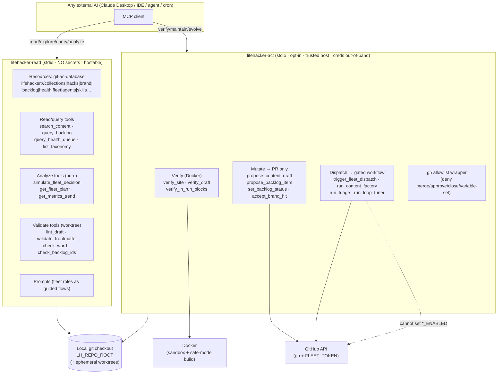

# Proposal: an MCP integration for lifehacker.dev

> Status: **draft / for review** · Author: `claude` · Companion to
> [`AUTOPILOT.md`](../../AUTOPILOT.md), [`docs/CICD.md`](../CICD.md),
> [`docs/runbook-fleet.md`](../runbook-fleet.md)

Make the whole of lifehacker.dev — the articles, Field Notes, docs, source, the brand-as-data, the health queue, and the fleet's OODA orchestration model — available to any AI over the **Model Context Protocol**, so an outside model (Claude Desktop, an IDE, another agent, a cron) can **review, explore, query, analyze, maintain, and evolve** the site *without ever becoming the self-merge loophole the human-review gate exists to prevent.*

This document is the plan. It was produced by exploring every subsystem, then designing and adversarially stress-testing three architectures; the feasibility corrections from that review are baked in below (they are the difference between a demo and a thing that survives contact with the actual scripts).

---

## 1. TL;DR

- **Two MCP servers, split on the security boundary** (which is also the
  deployment boundary):
  - **`lifehacker-read`** — zero secrets, no network, no `gh`, no Docker. Points
    at a local checkout (`LH_REPO_ROOT`). Serves the site as a navigable
    **resource tree** (git *is* the database) plus read/query/analyze/validate
    **tools** that shell the existing stdlib-Ruby scripts. Safe to hand to any
    external AI; hostable later once a path-allowlist + secret-scan exists.
  - **`lifehacker-act`** — opt-in, off by default, installed only on a trusted
    host with credentials injected out-of-band. Carries the Docker-backed
    **verify** tools and the thin, heavily-guarded **mutation** and **dispatch**
    tools. Every mutating path terminates at *open one PR* / *file one issue* /
    *dispatch one gated workflow* — **never** at a merge.
- **Guardrails by absence, enforced at the surface.** There is no
`merge_pr` / `approve_pr` / `close_human_issue` / `set_switch` tool anywhere in the API. This is the strongest available backstop because `main` is **not** branch-protected (per repo memory) — "the capability isn't in the protocol" beats "the capability is gated."
- **One source of truth.** Every query/validate/verify tool shells the *same*
Ruby scripts CI runs, so the MCP's answer is byte-identical to the merge gate — no second implementation to drift.
- **Ship read-first.** ~90% of the value (review / explore / query / analyze) is
in `lifehacker-read` and carries near-zero blast radius. Mutation and fleet control come later, phase-gated behind an explicit token-scope + rate-limit story.

---

## 2. The substrate (what we're wrapping)

lifehacker.dev is a Jekyll site on GitHub Pages (`bamr87/zer0-mistakes` remote theme, neon skin) that is *also* a headless CMS driven by Claude Code. The defining architectural fact: **there is no server and no database — git is the database.** Everything the autopilot knows is committed YAML / JSONL / Markdown, and every change reaches `main` through the same human-reviewed PR gate.

| Layer | Where it lives | What it is |
|---|---|---|
| **Content** | `pages/_posts/hacks` (61), `pages/_posts/tools` (25), `pages/_posts/field-notes` (102 Field Notes), `pages/_docs` (22), `pages/_about` (2) | The `posts`, `docs`, and `about` collections under `collections_dir: pages` — hacks/tools/field-notes are news **sections** of `posts`, under `pages/_posts/<section>/`. Typed front matter enforced by `lint_frontmatter.rb` (title/description/date/author/excerpt/tags; tools add `verdict`; every news item needs its section `categories` (Hacks / Tools / Field Notes) + filename-date match). Hacks/tools can carry ` ```bash lh:run ` fences that get executed in a sandbox. |
| **Brand as data** | `_data/brand/{identity,voice,glossary,accepted}.yml` | Machine-readable mission + 4 pillars, 4 voice profiles, the "banned-when-sincere" glossary, the Prime Directive, and the accept-ledger. Read by every content agent before drafting. |
| **AI orchestration** | `scripts/fleet/{dispatch,policy,plan,lease}.rb`, `_data/fleet/*` | A deterministic OODA controller. `policy.rb`/`plan.rb` are **pure functions**; `dispatch.rb` observes (queue + backlog + open-PR count), decides grow-vs-fix slots via `budget.yml`, and leases work to role agents. Backpressure = `MAX_OPEN_PRS`: throughput is clamped to human review speed by design. |
| **The fleet** | `.claude/agents/*.md` (14), `.claude/skills/*/SKILL.md` (15), `.github/workflows/*.yml` (18) | Roles: grow, review, bugfix, scout, explore, triage, retro, quest, devops, loop-tuner, brand (×2). Each gated by a `*_ENABLED` repo variable the bot token **cannot** set. |
| **Memory / the ratchet** | `_data/backlog.yml` (95 items), `metrics/history.jsonl`, `fleet/improvements.yml`, `retrospectives.yml`, `_data/health/{findings.jsonl,queue.json,summary.yml}` | The compounding loop: measure → verify last run's claims → fix upstream cause → record claim + snapshot → PR → human merges → next run verifies. |
| **Test harness** | `scripts/ci/*` | Reproduces Pages safe mode, emits the **frozen `findings.jsonl` contract** (`check_id｜severity｜file｜line｜rule｜evidence｜route_to｜prime_directive_candidate｜fingerprint`, `fingerprint = sha1(check_id｜downcased-file｜rule)[0,12]`), which `build_queue.rb` turns into the RICE-ranked `queue.json`. |
| **AI config** | `_data/ai.yml` | The one place the model/budget is set; everything routes through `scripts/ai/run.sh` → Claude Code CLI (fallback: `api_call.rb`). Auth is never committed. |

**The guardrails that must survive the MCP** (from `AUTOPILOT.md` + `grow-lifehacker`): no direct push to `main`; no self-merge / self-approve; no invented commands or output; honest attribution; bugs go upstream to `bamr87/zer0-mistakes`; no secrets / no deploy access; the `*_ENABLED` switch is a human's to flip.

---

## 3. Goal → surface mapping (the six verbs)

| Verb | What it means here | Primary MCP surface |
|---|---|---|
| **Review** | Read a draft or an open PR and judge it against the schema + brand + Prime Directive | `verify_draft`, `lint_draft`, `validate_frontmatter`, `verify_lh_run_blocks`; **prompt** `review_content_pr` |
| **Explore** | Navigate the git-as-database *and* the live published site | Resource tree (`lifehacker://…`), `search_content`; **prompt** `explore_live_site` (Playwright) |
| **Query** | Ask structured questions of content, taxonomy, backlog, health | `search_content`, `query_backlog`, `query_health_queue`, `list_taxonomy`, `get_*` reads |
| **Analyze** | Dry-run the OODA brain, read the ratchet, trend the metrics, audit the guardrails | `get_fleet_plan`, `simulate_fleet_decision`, `measure_loop`, `verify_improvements`, `get_metrics_trend`, `audit_guardrails` |
| **Maintain** | Verify the site, fix one finding, triage, keep the brand ledger tidy | `verify_site`, `accept_brand_hit`, `set_backlog_status`, `file_triage_issues`; **prompts** `fix_finding`, `triage_site` |
| **Evolve** | Draft new content, seed the backlog, drive a fleet loop, tune the loop | `propose_content_draft`, `propose_backlog_item`, `trigger_fleet_dispatch`, `run_*`; **prompts** `grow_content`, `tune_loop`, `write_retrospective`, `forge_quest` |

Every **Maintain/Evolve** item is PR- or issue-terminal. None can merge, approve, close a human issue, or flip a switch.

---

## 4. Architecture



### 4.1 Runtime & language

- **Server shell: TypeScript on the official `@modelcontextprotocol/sdk`.** Best
client compatibility (Claude Desktop, IDEs), first-class resource/tool/prompt primitives, and it matches the fleet's existing Node-adjacent tooling. The server is thin: it reads files and **shells the existing Ruby/bash scripts**, which stay the canonical implementation.
- **Keep the logic in Ruby.** Do *not* re-implement lints, planning, or the
findings contract in TS — that is exactly the drift the "one source of truth" principle forbids. Where a script has no machine-readable entrypoint today (fleet planning), add a tiny **first-party Ruby `--json` shim in the repo** (see §7) so the MCP wraps a real, audited entrypoint instead of scraping stdout.
- *Alternative considered:* a Ruby-native MCP server that `require_relative`s the
scripts directly (zero subprocess overhead, single language). Viable and arguably cleaner for the pure-function paths, but the TS SDK's client ecosystem wins for v1. Revisit if subprocess latency or a single-language mandate matters.

### 4.2 How each server reads the repo

Both servers point at a local checkout via `LH_REPO_ROOT` (git is the database; no live Pages fetch needed for reads). `lifehacker-read` parses committed `_data/**` (YAML `safe_load` only — never the repo's `unsafe_load`), `pages/_*/**` front matter (mirroring `ci/_lib.rb` `LH.parse`), and `*.jsonl` directly. For *computed* reads it shells the scripts. `lifehacker-act` additionally uses ephemeral **`git worktree add` off freshly-fetched `origin/main`** for every mutation and verification (see §5.4 and §6).

---

## 5. Guardrail model (the load-bearing section)

The single most valuable artifact in this whole plan is the **guardrail integrity test** described in §8-P4. Read this section as the spec for it.

### 5.1 No-merge by absence — and be honest about what enforces it

The surface contains **no** `merge_pr`, `approve_pr`, `close_issue` (on human issues), or `set_switch` tool. The MCP protocol surface therefore *tops out at "open one PR."* That is the enforcement.

**Correction the review forced (do not skip):** this is **surface-enforced, not token-enforced.** `FLEET_TOKEN` must have `contents:write` to push PR branches — which is exactly what `gh pr merge` needs — and `main` is not branch-protected. So a *compromised* `lifehacker-act` host could merge with the same token, regardless of which tools we expose. The token scope is **not** the merge backstop; the human review of the PR is. Two mitigations:

1. **`gh` allowlist wrapper (`A4`).** All `gh`/`git` calls on `lifehacker-act` go
through a wrapper that **denies** `pr merge`, `pr review --approve`, `issue close`, `variable set`, `api … --method PUT …/merge`, and
   `workflow enable|disable`. A mis-added tool or a prompt-injected model still
   can't reach a denied verb.
2. **Document the residual truth:** a compromised drive host is game-over the same
way it is today for the fleet. The MCP does not make this worse; it must not pretend to make it better.

### 5.2 The `*_ENABLED` consent gate stays a human's

The dispatch tools use `gh workflow run` to fire *already-gated* workflows. Each workflow idles behind its `*_ENABLED` repo variable, which requires `Variables:write` (Actions Variables) to flip. **The act token is deliberately denied `Variables:write`**, so the MCP can *dispatch* a loop but can never *enable* one. `get_switch_states` has no `set_switch` sibling, by design.

### 5.3 Token scopes (pinned — the review found the vague version breaks)

| Server | Needs | Fine-grained scope | Explicitly must NOT have |
|---|---|---|---|
| `lifehacker-read` | file reads + pure scripts | **none** (optionally `Actions:read` + `Variables:read` for live switch/PR counts) | anything write |
| `lifehacker-act` — mutate | branch push + `gh pr create` | `Contents:write` + `Pull requests:write` | `Administration`, `Variables:write` |
| `lifehacker-act` — dispatch | `gh workflow run` | **`Actions:write`** (this is *not* administration and *cannot* set variables) | `Administration`, `Variables:write` |
| `lifehacker-act` — read PR count / switches | `gh pr list`, `gh variable list` | `Actions:read` + `Variables:read` | — |
| upstream issues (theme/quest) | cross-repo `gh issue create` | a **separate** token for `bamr87/zer0-mistakes` / `bamr87/it-journey` | write to lifehacker beyond issues |

> The naïve "contents + PRs only, no workflows" story in the first drafts is
> **wrong**: `gh workflow run` returns 403 without `Actions:write`. Grant exactly
> `Actions:write` and assert (in CI, §8-P4) that `Administration` and
> `Variables:write` are absent — dispatch works, self-enable stays impossible.

### 5.4 Untrusted input is quarantined, and it's marked as such

Externally-sourced text surfaced as resources (scout ideas in `_data/scout/ideas.jsonl`, findings `evidence`, PR/issue bodies) is **data, not instructions.** Every such resource is wrapped in an explicit `<untrusted>…</untrusted>` envelope and its description cites [`.claude/skills/_shared/quarantine.md`](../../.claude/skills/_shared/quarantine.md) (which already exists and encodes the rule). Driver-supplied strings written to any `_data` file are coerced to plain escaped YAML scalars — never round-tripped through the repo's `unsafe_load` — to close the YAML-injection vector.

### 5.5 Provenance

`lifehacker-act` commits as the Claude `noreply` identity and pushes with `FLEET_TOKEN` — the *same* identity/token the scheduled fleet uses, so MCP-driven PRs are today indistinguishable from factory PRs. Add a **PR-body provenance stamp** (`via: mcp/<tool> · driver: <client>`) so a human reviewer can tell an interactively-driven change from a scheduled one. (A distinct bot sub-identity is the heavier alternative.)

---

## 6. Feasibility corrections (what the adversarial review caught)

These are not nitpicks — each one is the difference between a tool that works and one that silently returns garbage. All are verified against the actual scripts.

1. **Draft linting needs a worktree, not a string.** `lint_frontmatter.rb` takes
**no** argument/stdin and always globs the four `pages/_*` dirs; `lint_brand.rb` supports changed-file scoping (`LH_BRAND_CHANGED_FILES`, which the pipeline already sets) but only as an **intersection filter over files that
   exist under `pages/_*`**; `run_hack_commands.rb` globs `pages/_posts/hacks|tools`.
→ **Materialize the draft into `pages/_<collection>/<slug>.md` inside an ephemeral worktree, run the exact lints with `LH_BRAND_CHANGED_FILES` set to that path, filter `lint_frontmatter` output to it, then discard the worktree.** There is one materialization path; no second linter. Raw-string linting is deferred until that temp-write mechanism is proven cleanup-safe.

2. **`test-results/` is a shared, hardcoded path** (`LH::RESULTS = ROOT/test-results`)
that every lint overwrites. Two concurrent verify calls clobber each other and can return another caller's findings. → **Run each verification in its own worktree/CWD** (so `LH::RESULTS` resolves to a private dir) *or* serialize behind a lock. Do not offer these from a concurrent HTTP server without isolation. (This also fixes the "read-only tool still writes to the checkout" wrinkle — even the pure lints `mkdir` + write `test-results/`.)

3. **`get_fleet_plan` must NOT shell `dispatch.rb`.** `dispatch.rb`'s *first*
action after arg-parse is the kill switch: `unless ENV['FLEET_ENABLED'] == 'true' … exit 0` — it returns **before** computing any plan, and `FLEET_ENABLED` is **off by default**. It also calls `gh pr list` (needs auth) and has no `--json`. → **Call `Fleet::Plan.compute` / `Fleet::Policy.decide` directly** (both pure, IO-free, already exercised by `scripts/sim/simulate.rb`), computing freshness from `_data/health/summary.yml` `generated_at` vs `budget.yml` `queue_max_age_minutes`. This needs the small first-party shim in §7. On the read plane with no `gh`, **refuse to emit a headroom verdict** (return `open_prs: unknown`) rather than degrading to `0 = full headroom`, which would systematically encourage over-dispatch.

4. **The dup-backlog-id guard is currently disconnected from the gate.**
`lint_artifacts.rb` *does* emit an `error`-severity `duplicate-backlog-id` finding — but `aggregate.rb`'s `CHECK_FILES` (`frontmatter drift brand prime-directive htmlproofer build`) **excludes `artifacts`**, and `run-all.sh`
   runs `lint_artifacts.rb || true` (swallowing its exit). *As wired today, a
duplicate id does not reach the merge gate.* This contradicts the operating assumption that a dup id reddens `verify` for every PR. → Two actions: (a) file the **one-line repo fix** (add `artifacts` to `CHECK_FILES`) if blocking is intended; (b) the MCP's `check_backlog_ids` wraps `lint_artifacts.rb` and runs on the **post-append worktree before** opening any backlog PR. **But** `lint_artifacts` only sees committed `backlog.yml`; two concurrent callers each mint the same next id and collide on merge (`backlog.yml` is `merge=union`, no dedupe). So mint ids from a **single serialized path** — either route adds through the PR *description* (the repo's own answer, via `harvest_ideas.rb`) or reserve ids gh-aware against open PRs.

5. **`verify_improvements` over-promised.** The flag is `--self-test` (a synthetic
schema check), *not* a live re-measure; real re-measurement needs `loop_metrics.rb --json`, which shells `gh` (drive plane only). And `metrics/history.jsonl` holds ~2 snapshots today, so most verdicts read `pending` regardless. → On the read plane, demote to "compare the ledger against the last **committed** history snapshot, as of `<commit>`"; put live re-measure on the drive plane; **label the signal low-confidence** until history deepens. Same caveat retires `get_metrics_trend` from the P0/P1 shipping set until there are enough windows.

6. **`accept_brand_hit` must compute the key server-side.**
`accept_key = sha1(rel｜word.downcase｜line.strip)[0,12]` hashes the **raw source line**, not the human-facing (truncated/prefixed) `evidence` string. → `lint_draft` returns the exact raw line **and** the precomputed `accept_key`; `accept_brand_hit` consumes that key, echoes back the resolved key + sentence, and writes only to `_data/brand/accepted.yml`. Otherwise the accept lands but licenses nothing and the hit re-opens forever.

7. **`audit_guardrails` audits the *repo*, not the MCP.** `audit.rb` statically
inspects `.github/workflows/*` — it cannot see the MCP's own tool inventory or runtime token. → Add an **MCP-side self-audit** at startup: enumerate the server's registered tools (assert no merge/approve/close verb), probe `gh auth status` / token scopes (assert `Actions:write` present, `Administration`/`Variables:write` absent), and **refuse to serve the mutating tools if any invariant fails.** Keep `audit.rb` for the repo; don't conflate.

8. **Analytics is a known placeholder.** `_data/analytics/summary.json` is
`stale: true` with a reach multiplier of 1.0 (severity alone ranks the queue). → Surface `analytics_stale: true` on any queue/score resource so a driver never silently over-trusts `reach`. (There is a Google-Analytics MCP already in the ecosystem — `refresh_analytics.rb` — worth wiring as a downstream data source.)

---

## 7. Required repo-side changes (small, first-party, PR'd normally)

The MCP wraps the repo — but a few thin, audited entrypoints belong **in the repo** so the MCP shells a real thing instead of re-deriving it. Each is a normal human-reviewed PR.

| Change | File | Why |
|---|---|---|
| Plan-only JSON emitter | new `scripts/fleet/plan_json.rb` (or `dispatch.rb --plan-json`) that calls `Fleet::Plan.compute` with explicit `open_prs`/`fresh` and prints JSON — **never** touching `FLEET_ENABLED` | So `get_fleet_plan`/`simulate_fleet_decision` wrap an entrypoint, not scraped stdout (§6.3) |
| Per-invocation results dir | honor `LH_RESULTS_DIR` in `ci/_lib.rb` (fallback to `ROOT/test-results`) | Concurrency isolation without a worktree in the simplest cases (§6.2) |
| Optional single-file frontmatter scope | honor `LH_FRONTMATTER_CHANGED_FILES` in `lint_frontmatter.rb` (mirror `lint_brand`) | Cleaner draft-scoping than post-filtering whole-repo output (§6.1) |
| Connect the dup-id guard | add `artifacts` to `aggregate.rb` `CHECK_FILES` **iff** blocking is intended | Makes the existing guard actually gate (§6.4) — decide this deliberately |
| Serialized backlog-id minting | factor append + id-mint + dedup into one entrypoint the MCP and fleet both call | Closes the parallel-writer dup-id race (§6.4) |

These are the only in-repo changes the MCP *requires*. Everything else is additive and lives in a separate MCP package/repo.

---

## 8. Delivery plan (phased, read-first)

Each phase ships independently and has a **Definition of Done** that includes the guardrail test where relevant. Rough effort in engineer-weeks.

### P0 — Read-only resource spine · `lifehacker-read` · ~1 wk
The git-as-database resource tree: `collections/{collection}`, `posts|docs|about/{slug}`,
`schema/{collection}`, `tags/{tag}`, `categories/{category}`, `backlog[/{id}]`, `authors`, `brand/{identity,voice[/{profile}],glossary,accepted}`, `health/{queue,summary,findings}`, `metrics/history`, `fleet/{budget,state,leases,improvements}`, `agents/{name}`, `skills/{name}`, `roles`, `retrospectives`, `scout/ideas`, `switches` (names only, from workflow files), `guardrails`, `config/effective`. Plus read/query tools: `search_content`, `get_content_item`, `list_taxonomy`, `query_backlog`, `query_health_queue`, `get_brand_identity`, `resolve_voice_profile`, `check_word`, `get_gate_summary`, `list_switch_names`. **DoD:** all resources resolve from a fresh checkout with no secrets/network; the frozen `findings.jsonl` fields pass through verbatim; untrusted resources carry the quarantine envelope.

### P1 — Analyze + validate (still read-plane) · ~1 wk
`simulate_fleet_decision` (pure), `get_fleet_plan` (via the §7 shim, freshness-aware, `open_prs: unknown` without `gh`), `check_backlog_ids`, `validate_frontmatter` + `lint_draft` (**worktree-materialized**, §6.1/6.2), `verify_improvements` (committed-snapshot mode, low-confidence label). **DoD:** `validate_frontmatter`/`lint_draft` produce byte-identical findings to CI for the same file; concurrent calls don't clobber; `get_fleet_plan` returns nothing-but-honest when `gh` is absent.

### P2 — Verify edge (Docker) · `lifehacker-act` read side · ~1 wk
`verify_site` (safe-mode build + all lints + aggregate), `verify_draft` (scoped to one file), `verify_lh_run_blocks` (the `--network=none` read-only non-root Docker sandbox), `build_site`. Each runs in its own worktree. **DoD:** `verify_lh_run_blocks` proves a hack's `lh:run` blocks in the sandbox and degrades to `unverified` (never runs on host) when Docker is absent; results are per-invocation isolated.

### P3 — Thin guarded mutation via worktree + PR · ~1.5 wk
`propose_content_draft`, `propose_backlog_item` (serialized id mint + post-append `check_backlog_ids`), `set_backlog_status` (own-line edit), `accept_brand_hit` (server-side key). Each: `git worktree add` off fresh `origin/main` → write in its declared lane only → **self-assert the diff touches no path outside the lane** → commit (provenance stamp) → `gh pr create` → remove worktree. Content lane = `pages/**`; brand-accept lane = `_data/brand/accepted.yml`; backlog lane = `_data/backlog.yml`. **DoD:** every mutation tool hard-aborts if its diff escapes its lane; no merge/approve/close verb exists; the PR re-triggers `verify`.

### P4 — Guardrail integrity gate (the keystone) · ~0.5 wk
A **required CI status check on the MCP repo** that asserts: (a) the registered tool inventory contains no `merge`/`approve`/`close-human-issue`/`set-variable` verb; (b) the act token has `Actions:write` but **not** `Administration` or `Variables:write`; (c) the `gh` allowlist wrapper denies the forbidden verbs; (d) `audit.rb` + `simulate.rb` still pass on the lifehacker repo. This is the artifact that keeps a later "convenience" PR from quietly adding a merge tool. **DoD:** the check is required and red-fails on any violation.

### P5 — Fleet control + issues · ~1 wk
`trigger_fleet_dispatch`, `run_content_factory`, `run_triage`, `run_loop_tuner` (all `gh workflow run`, dry-run by default, `--apply` explicit, **MCP-side cooldown + "refuse if a run is already in flight"**), `file_triage_issues` (bounded: label / draft-comment / propose-close / promote — never close a human issue), `get_switch_states` (drive-plane booleans), `list_content_prs`, `audit_guardrails`. **DoD:** dispatch tools 200 with the pinned scope and cannot flip a switch; a looping driver cannot spam Actions minutes.

### P6 — Prompt library + role coverage · ~1 wk
The fleet roles as guided **prompts** (§9), including the ones the first drafts omitted: `review_content_pr`, `explore_live_site` (Playwright/site-explorer), `scout_sister_site`, `write_retrospective`, `forge_quest`, `sweep_brand_debt`, `adjudicate_brand`, `audit_cicd`, plus content-import. **DoD:** each prompt hands the driver the real skill procedure + least-privilege scope + hard rules, wired to the matching resources/tools.

### P7 — Hardening + hosted read variant · ~0.5–1 wk
Only *after* a **path-allowlist + pre-deploy secret-scan gate** exists, expose `lifehacker-read` as a Streamable-HTTP instance stamped with `commit` + `generated_at`, failing **closed** on staleness. Full untrusted-input test suite; colophon-logging hook for any guardrail-adjacent change. **DoD:** the hosted instance serves only an allowlisted path set, holds no secret, and never presents stale state as live.

---

## 9. The tool / resource / prompt surface (consolidated)

### 9.1 Resources — the git-as-database tree (read plane)
Content (`collections/{c}`, `posts|docs|about/{slug}`,
`schema/{c}`, `tags/{tag}`, `categories/{cat}`) · Brand
(`brand/identity|voice[/{profile}]|glossary|accepted`) · Data & memory
(`backlog[/{id}]`, `authors`, `config/effective`, `retrospectives`, `scout/ideas`) ·
Health (`health/queue|summary|findings`, `metrics/history`) · Fleet
(`fleet/plan|budget|state|leases|improvements`, `roles`, `switches`, `guardrails`) ·
Fleet self-description (`agents/{name}`, `skills/{name}`).

### 9.2 Tools (mutation and plane marked)

| Tool | Plane | Mut? | Backing | Notes |
|---|---|---|---|---|
| `search_content`, `get_content_item`, `list_taxonomy` | read | – | front-matter parse | mirrors index/tags Liquid |
| `query_backlog`, `query_health_queue`, `get_gate_summary` | read | – | `backlog.yml`, `queue.json`, `summary.json` | frozen fields verbatim |
| `get_brand_identity`, `resolve_voice_profile`, `check_word` | read | – | `_data/brand/*` | on-voice writing aid |
| `list_switch_names` | read | – | workflow files | names only (no `gh`) |
| `simulate_fleet_decision` | read | – | `policy.rb`/`plan.rb` (pure) | cleanest analyze tool |
| `get_fleet_plan` | read | – | §7 shim → `Plan.compute` | `open_prs: unknown` w/o gh |
| `check_backlog_ids` | read | – | `lint_artifacts.rb` | run post-append (§6.4) |
| `validate_frontmatter`, `lint_draft` | read* | – | `lint_frontmatter`/`lint_brand` | *worktree-materialized |
| `verify_improvements`, `get_metrics_trend` | read | – | committed history | low-confidence until history deepens |
| `verify_site`, `verify_draft`, `verify_lh_run_blocks`, `build_site` | act | – | `run-all.sh`/`build.sh`/sandbox | Docker; per-invocation isolation |
| `propose_content_draft`, `propose_backlog_item`, `set_backlog_status`, `accept_brand_hit` | act | ✔ | worktree + `gh pr create` | PR-terminal; lane-asserted |
| `trigger_fleet_dispatch`, `run_content_factory`, `run_triage`, `run_loop_tuner` | act | ✔ | `gh workflow run` | gated workflow; cooldown |
| `file_triage_issues` | act | ✔ | `file_issues.rb` | bounded actions only (quarantine) |
| `get_switch_states`, `list_content_prs`, `audit_guardrails` | act | – | `gh` + `audit.rb`/`simulate.rb` | booleans need `Variables:read` |

**Absent by construction:** `merge_pr`, `approve_pr`, `close_issue` (human), `set_switch`, anything Administration-scoped.

### 9.3 Prompts (fleet roles as guided workflows)
`grow_content`, `review_content_pr`, `fix_finding`, `scout_sister_site`, `explore_live_site`, `triage_site`, `write_retrospective`, `forge_quest`, `audit_cicd`, `tune_loop`, `adjudicate_brand`, `sweep_brand_debt`, `verify_before_pr`, `pick_next_backlog`, `orient_fleet`, `ratchet_report`, `explain_guardrails`. Each is synthesized from the agent's own `tools:` frontmatter
+ its `SKILL.md` procedure + the hard rules, so the role's least-privilege
boundary travels with the prompt.

---

## 10. Risks & open questions

1. **Compromised drive host = merge access** (§5.1). Residual and unchanged from
today. Mitigation is the `gh` allowlist + not pretending otherwise. *Should we push to enable branch protection on `main` so the token literally cannot merge? (Owner previously declined — worth revisiting given this integration.)*
2. **Dup-id gate**: is the disconnect (§6.4) intentional or a latent bug? Decide
   before wiring `check_backlog_ids`.
3. **Live-site exploration** requires the Playwright MCP + a browser on the drive
   host; `explore_live_site` is a *prompt* that composes it, not a native tool.
4. **Ratchet/metrics are thin** (~2 snapshots). The "watch the ratchet flip"
   feature is mostly inert until history deepens — ship it labeled, don't oversell.
5. **Hosted read exfil surface** (§8-P7): a mis-committed secret in the checkout
   becomes world-readable. Gate hosting behind path-allowlist + secret-scan.
6. **Non-content maintenance gap**: the mutation lane is content-only; drift /
local-infra findings are actionable only via dispatch or a human. That's a deliberate scope boundary, not an oversight — name it.

---

## 11. Appendix — subsystem → surface map

| Subsystem | Read as | Acted on via |
|---|---|---|
| Content collections | `lifehacker://{collection}/{slug}`, `search_content` | `propose_content_draft`, `verify_draft` |
| Front-matter schema | `lifehacker://schema/{c}` | `validate_frontmatter` |
| `lh:run` fences | (in body) | `verify_lh_run_blocks` (Docker sandbox) |
| Brand-as-data | `lifehacker://brand/*`, `get_brand_identity`, `check_word` | `accept_brand_hit`, `lint_draft` |
| Backlog | `lifehacker://backlog[/{id}]`, `query_backlog` | `propose_backlog_item`, `set_backlog_status` |
| Health / findings | `lifehacker://health/*`, `query_health_queue`, `get_gate_summary` | `verify_site`, `file_triage_issues`, `run_triage` |
| Fleet OODA | `lifehacker://fleet/*`, `roles` | `get_fleet_plan`, `simulate_fleet_decision`, `trigger_fleet_dispatch` |
| Memory / ratchet | `lifehacker://fleet/improvements`, `metrics/history` | `verify_improvements`, `run_loop_tuner` |
| Guardrails | `lifehacker://guardrails`, `switches` | `audit_guardrails`, `get_switch_states` |
| Agents & skills | `lifehacker://agents|skills/{name}` | the role **prompts** |
| Live site | — | `explore_live_site` prompt (Playwright) |

---

*Produced by exploring every subsystem and stress-testing three architectures against the actual scripts. The corrections in §6 are the ones that make the difference between "wraps the scripts" and "reimplements them wrong."*
