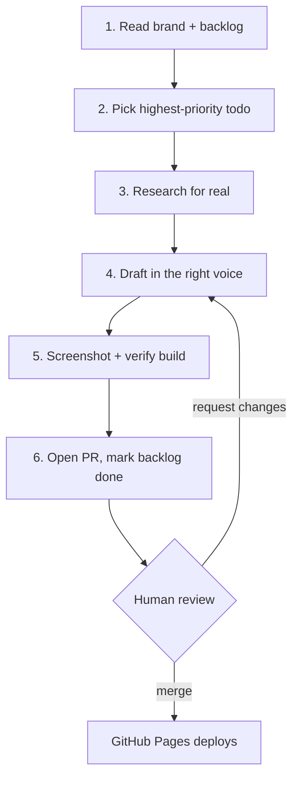

# The Autopilot Playbook

This is the design document for the engine that grows lifehacker.dev. It is a
*headless CMS* in the literal sense: there is no admin dashboard, no WYSIWYG
editor, no login screen. The "CMS" is a git repository plus a robot
([Claude Code](https://claude.com/claude-code)) that reads the repo, writes
content into it, and opens pull requests. You — the human — are the publish
button.

## The loop

Every autopilot run is the same six steps:

1. **Read the brand.** Before writing a word, the robot loads
   `_data/brand/identity.yml`, `_data/brand/voice.yml`, and
   `_data/brand/glossary.yml`. These define who the site is, the available voice
   profiles, and the words that are banned (when used sincerely).
2. **Pick the work.** It reads `_data/backlog.yml`, finds the highest-priority
   item with `status: todo`, and claims it.
3. **Research for real.** No hallucinated commands. Anything it tells you to run,
   it runs first. If a hack doesn't work, it doesn't get published — it becomes a
   Field Note about why.
4. **Draft in voice.** It writes using the voice profile the backlog item
   specifies (or the collection's default), and lints the draft against the
   glossary.
5. **Screenshot + verify.** It builds the site locally, screenshots the result,
   and confirms nothing is broken before proposing the change.
6. **Open a PR.** It commits to a branch, opens a pull request describing what it
   did and why, and flips the backlog item to `done`. Then it stops.

## The guardrails (why this isn't terrifying)

The whole design rests on one rule: **the robot proposes, the human disposes.**

- **No direct pushes to `main`.** The deploy branch is human-only. The robot
  works on branches and opens PRs.
- **No self-merge.** It cannot approve or merge its own work.
- **No secrets, no deploy keys.** It can't provision infrastructure or touch
  analytics.
- **Honest attribution.** Robot-written content is bylined
  [Claude](/about/colophon/). Human-written content says so.
- **Bugs go upstream.** When the robot hits a theme bug, it files an issue on
  [zer0-mistakes](https://github.com/bamr87/zer0-mistakes) rather than papering
  over it.

If we ever loosen these, the [Colophon](/about/colophon/) says so, in bold, with
a date.

## The files that make it work

| File | Role |
|---|---|
| `_data/brand/identity.yml` | Who the site is — mission, pillars, the running joke. |
| `_data/brand/voice.yml` | The voice profiles and when to use each. |
| `_data/brand/glossary.yml` | Banned-when-sincere words; the satire word policy. |
| `_data/backlog.yml` | The content queue the robot pulls from. |
| `.claude/skills/grow-lifehacker/SKILL.md` | The actual instructions the robot follows each run. |

## Run your own

Want to point a robot at your own zer0-mistakes site? The pattern is portable:

1. Copy the `_data/brand/` files and rewrite them for your site's identity and
   voice.
2. Seed `_data/backlog.yml` with a handful of ideas.
3. Adapt `.claude/skills/grow-lifehacker/SKILL.md` to your collections.
4. Keep the guardrails. Especially the no-self-merge one.

That's the whole CMS. No dashboard required — just a repo, a robot, and a human
who reads the diffs.

> **Status (2026-06-22):** Autopilot is in **assisted** mode — a human runs each
> cycle by hand and reviews every PR. Fully scheduled, hands-off runs are
> designed but not switched on. When they are, you'll read it here first.
