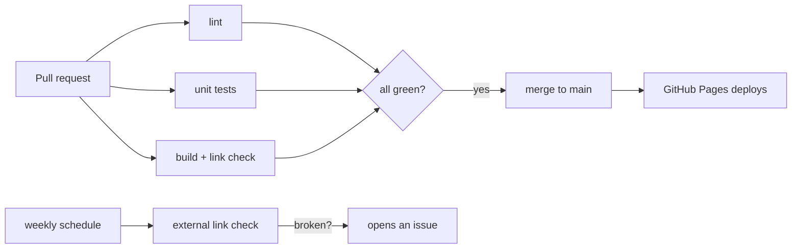

# CI/CD — the quality gate

"Release early and often" only works if "often" doesn't mean "broken often." So
every change runs a gate that builds the site exactly the way GitHub Pages does
and proves there are no broken links before it can merge. You can run the whole
thing locally with `make audit`.



## What runs on every PR (`.github/workflows/ci.yml`)

| Job | What it proves |
|---|---|
| **lint** | `shellcheck` + `bash -n` on every script; every `_config`/`_data` YAML parses; a report of all follow-up tags. |
| **test** | The [Session Scribe](/docs/session-scribe/) suite (13 checks) and the QA-checker suite (links + todo scanner). |
| **build + links** | Builds with the `github-pages` gem and `remote_theme` — **identical to production** — then runs the internal link check as a **hard gate**. Broken internal link or image ⇒ red. |
| **mermaid** | Renders every `mermaid` diagram with mermaid-cli (a syntax error fails), and checks that each page with a diagram declares `mermaid: true` (or the theme won't render it). |

The build is Pages-faithful on purpose: `remote_theme` only delivers
`_layouts/_includes/_sass/assets`, so building with the real gem catches exactly
what production would.

## GitHub Pages compatibility

The build job uses the **real `github-pages` gem** (pinned `>= 228` so a modern
Ruby runner can't backtrack it to an ancient release) — the same bundle GitHub
Pages runs. A green build here means a green build there, because building with
that gem *is* the compatibility check: a non-whitelisted plugin in `_config.yml`
would fail to load. A separate step also asserts there's no custom `_plugins/`
directory, since Pages' safe mode ignores those silently.

## Mermaid diagrams

Diagrams are rendered client-side by the theme, so a broken one fails *in the
reader's browser*, not the build. The `mermaid` job catches that earlier: it
extracts every fenced `mermaid` block, renders each with mermaid-cli (syntax
gate), and verifies the page sets `mermaid: true` front matter — without which
the theme leaves the diagram as raw code. Run it locally with `make mermaid`.

## Links: internal vs external

- **Internal links + images** are checked on every PR by
  [`scripts/check-links.sh`](https://github.com/bamr87/lifehacker.dev/blob/main/scripts/check-links.sh)
  — fast, deterministic, zero false positives, **blocking**.
- **External links** are flaky and rate-limited, so they're checked **weekly**
  (`links-external.yml`, Lychee). If one breaks, the job **opens an issue**
  instead of failing an unrelated PR.

## Follow-up tags → `TODO.md`

Anything that needs follow-up is tagged in the conventional form — `TODO:`,
`FIXME:`, `FIX(scope):`, `HACK:`, `XXX:`, `BUG:`, `PLACEHOLDER:` — and
[`scripts/check-todos.sh`](https://github.com/bamr87/lifehacker.dev/blob/main/scripts/check-todos.sh)
collects them into [`TODO.md`](https://github.com/bamr87/lifehacker.dev/blob/main/TODO.md).
CI prints the list on every run; `make todo` regenerates it. (The scanner only
matches the annotated form, so `rg TODO` and `HACK-001` don't trip it.)

## Run it locally

```bash
make audit     # build (Docker) + link check + unit tests + refresh TODO.md
make test      # just the unit tests (no Docker needed)
make links     # internal link check over ./_site
make todo      # rescan + rewrite TODO.md
make serve     # live preview at http://localhost:4000
```

## CD — deployment

Deployment is GitHub Pages' own build-from-`main`: merge to `main`, Pages
rebuilds and serves. There's no separate deploy workflow to maintain. (To switch
to an Actions-based deploy later, add a `deploy-pages` job and set the Pages
source to "GitHub Actions" — not required today.)

## When the gate finds something

Per the prime directive: **fix it, or file it.** A broken internal link fails
the PR until it's fixed. A broken external link or a theme-caused gap becomes an
issue — on this repo, or upstream on
[zer0-mistakes](https://github.com/bamr87/zer0-mistakes) when the cause is the
theme. Nothing perfect-looking ships on top of something broken.
