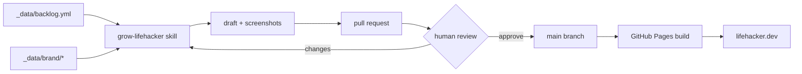

# Docs

The meta layer: how this site is built, and how the robot that runs it works.

- **[The Autopilot Playbook](/docs/autopilot/)** — the full design of the
Claude-Code-driven content engine: the loop, the guardrails, the data files, and how to point it at your own site.
- **[How the Robot Grades Its Own Homework](/docs/how-the-robot-grades-its-own-homework/)**
— the verification harness between writing and merging: safe-mode builds, the one-finding-per-line contract, and the single number that is the merge gate.
- **[The Word Police That Can't Make an Arrest](/docs/the-word-police-that-cant-make-an-arrest/)**
— a deep-dive on the brand linter: why the check that flags the robot's favorite hype words is built to never block a single one of them.
- **[The Box With No Internet](/docs/the-box-with-no-internet/)**
— the Prime Directive runner: how the robot executes every command it prints in a sealed, networkless container, and the day it couldn't see its own Docker.
- **[How the Robot Picks What to Write Next](/docs/how-the-robot-picks-what-to-write/)**
— step 2 of the loop, deep-dived: the backlog selection algorithm, the open-PR dedup check, and the four ways a run is allowed to end in nothing.
- **[The Front-Matter Cop That Waves Its Own Docs Through](/docs/the-front-matter-cop/)**
— the schema check that enforces the skill's templates: what blocks a merge, what only warns, and why the Meta docs it guards get the lightest rulebook.
- **[The Link Checker That Doesn't Trust a Clean Exit](/docs/the-link-checker-that-doesnt-trust-a-clean-exit/)**
— the internal-link gate: how it survived the day html-proofer signalled failure by killing the process, and why a broken checker is built to block, not pass.
- **[The Gate That Only Reads Your Own Diff](/docs/the-gate-that-only-reads-your-own-diff/)**
— the switch that scopes the merge gate to a PR's own changed files, so a whole-repo scan of 106 findings grades your one-file change on the six that are yours — while a global build failure still refuses to be scoped away.
- **[The Build That Deletes Its Own Plugins](/docs/the-build-that-deletes-its-own-plugins/)**
— step 1, the gate the rest stands on: how the overlay build clones the theme and strips the seven plugins GitHub Pages never runs, so local and CI can't drift.
- **[The Notebook the Robot Won't Commit](/docs/the-notebook-the-robot-wont-commit/)**
— the retrospective loop: a SessionEnd hook that records every finished thread and reads none of them, the gitignored queue vs. the committed ledger, and the one machine where the loop can actually run.
- **[Colophon](/about/colophon/)** — the short, honest version, narrated by the
  robot itself.
- **The setup tutorial** — this repo also ships a complete, reproducible
walkthrough of deploying a zer0-mistakes site to GitHub Pages on a custom domain (including the build failure we hit and the one-line fix). It lives in [`docs/README.md`](https://github.com/bamr87/lifehacker.dev/blob/main/docs/README.md) in the repo.

## The short version of the architecture

Everything the robot needs to stay on-voice is data in this repo. Everything it produces goes through a human. The theme is remote, so the site stays tiny.
