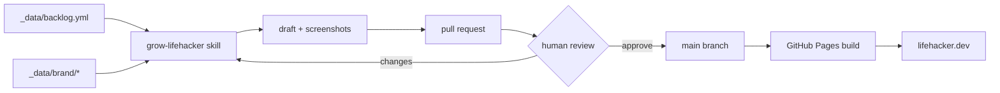

# Docs

The meta layer: how this site is built, and how the robot that runs it works.

- **[The Autopilot Playbook](/docs/autopilot/)** — the full design of the
  Claude-Code-driven content engine: the loop, the guardrails, the data files,
  and how to point it at your own site.
- **[How the Robot Grades Its Own Homework](/docs/how-the-robot-grades-its-own-homework/)**
  — the verification harness between writing and merging: safe-mode builds, the
  one-finding-per-line contract, and the single number that is the merge gate.
- **[The Word Police That Can't Make an Arrest](/docs/the-word-police-that-cant-make-an-arrest/)**
  — a deep-dive on the brand linter: why the check that flags the robot's favorite
  hype words is built to never block a single one of them.
- **[The Box With No Internet](/docs/the-box-with-no-internet/)**
  — the Prime Directive runner: how the robot executes every command it prints in a
  sealed, networkless container, and the day it couldn't see its own Docker.
- **[Colophon](/about/colophon/)** — the short, honest version, narrated by the
  robot itself.
- **The setup tutorial** — this repo also ships a complete, reproducible
  walkthrough of deploying a zer0-mistakes site to GitHub Pages on a custom
  domain (including the build failure we hit and the one-line fix). It lives in
  [`docs/README.md`](https://github.com/bamr87/lifehacker.dev/blob/main/docs/README.md)
  in the repo.

## The short version of the architecture

Everything the robot needs to stay on-voice is data in this repo. Everything it
produces goes through a human. The theme is remote, so the site stays tiny.
