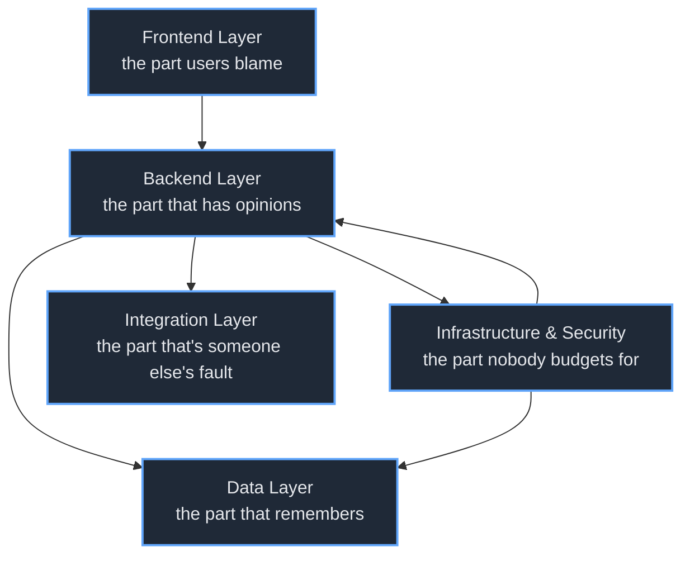
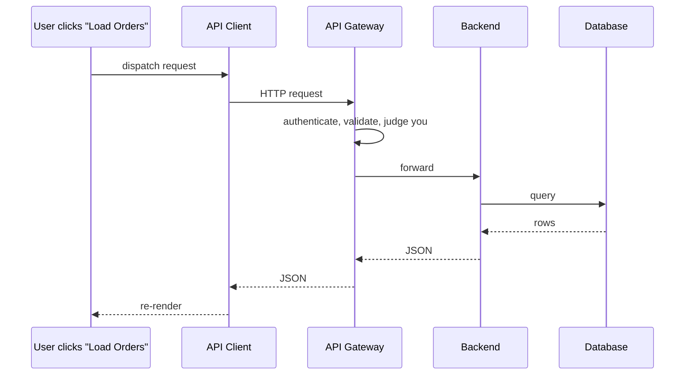
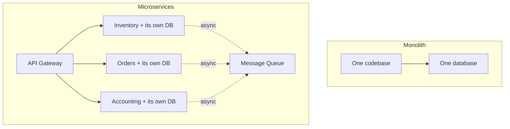
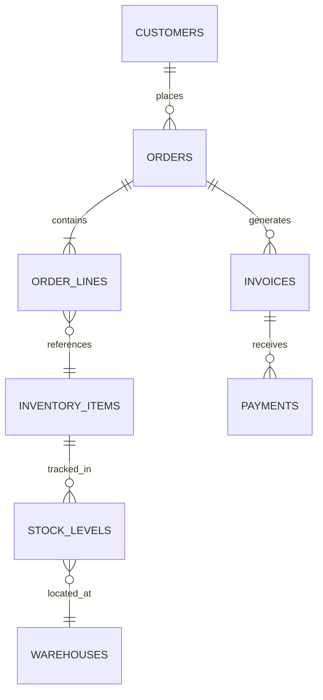

Nobody sets out to build a five-tier monster.

You set out to build a login page. Then sales needs to see orders, so there's a database. Then orders need to check stock, so there's a second service. Then the second service is slow, so there's a cache. Then the cache is wrong, so there's a message queue named after a Norse god of thunder. Eighteen months later you are standing in front of an architecture diagram with five labeled boxes, explaining to a new hire that this is, and I quote, "pretty standard."

It is standard. That's the unsettling part. Modern ERP systems — the software that runs inventory, payroll, accounting, and the supply chain for businesses that are too big to run on a spreadsheet and too scared to admit they'd like to — almost all converge on the same five-tier shape. Not because someone designed it that way. Because gravity pulls every sufficiently large business app toward the same five buckets.

This is a tour of those five layers: what each one is for, what it quietly does instead, and which decisions inside it you will not be allowed to take back. Nothing here was deployed — I didn't stand up an ERP to write a blog post, and you should be suspicious of anyone who claims they did. This is a map, not a build log. The map is still useful. Maps usually are.

Here is the whole monster on one page.

Five boxes. Let's open each one.

## Layer 1: The Frontend — the part users blame

The frontend is the only layer your users will ever see, which means it absorbs 100% of the complaints and roughly 15% of the actual bugs. Someone's payroll didn't run because a foreign key in the data layer was misconfigured? They will tell you "the website is broken." They are not wrong. They are pointing at the wrong box.

This layer is a browser, some HTML and CSS, a JavaScript framework, and a client that talks to the backend over HTTP. The framework is React, Vue, or Angular, and the choice matters far less than the eight-week meeting you will hold to make it.

That round trip is the whole job. A user does a thing, the thing becomes a request, the request travels four layers deep to fetch some numbers, and the numbers come back. Every dashboard, every form, every report you have ever loved or hated is that loop, running over and over, fast enough that you don't notice the four layers it crossed.

The useful, un-funny truth about the frontend: spend your effort on the boring parts. Keyboard navigation. Screen-reader labels. Error messages that say what to do next instead of `Error: undefined`. The accountant using this thing 200 times a day cares about none of your animation work and all of your tab order.

## Layer 2: The Backend — the part that has opinions

The backend is where the business rules live, which is a polite way of saying it is where the arguments are stored. "Can a customer over their credit limit place an order?" is not a technical question. It is a fight between sales and finance that someone eventually wrote down as an `if` statement, and that `if` statement now lives in the backend forever, long after both of those people have left the company.

Architecturally it's a web server (Nginx, usually), an application server running your actual code, an API gateway doing authentication and rate limiting, and then the modules — the dozen or so business domains that ARE the ERP. Inventory. Orders. CRM. HR. Accounting. Each is a small world with its own rules.

This is also where the one genuinely consequential decision of the whole project gets made, and it gets made wrong in both directions.

### Monolith vs. microservices: the decision you can't un-make cheaply

The pitch for microservices is that each domain ships and scales independently. The reality nobody puts on the slide: you have traded code complexity you can see — a big codebase — for distributed-systems complexity you cannot. Your bug is no longer in a function. It's in the half-second of network between two services, in the order three messages arrived, in a database that is "eventually consistent" and chose this exact moment to be eventual.

The honest default for most teams: **start with a monolith.** Build one application against one database, draw clean module boundaries inside it, and extract a service only when a specific domain genuinely needs to scale or deploy on its own. The teams who regret their architecture are almost never the ones who waited too long to split. They're the ones who opened with seventeen services and a Kubernetes cluster to run a tool for forty users.

The data layer's ORM lives here too — Sequelize, Hibernate, Entity Framework, the translator that turns your objects into SQL and occasionally into a query that joins six tables and ruins everyone's afternoon. Which is a nice transition, because the SQL has to land somewhere.

## Layer 3: The Data Layer — the part that remembers

Everything else in the stack can be restarted, redeployed, or set on fire and rebuilt from a Docker image. The data layer is the one part that cannot, because it is the only part that actually knows anything. Lose a service: annoying. Lose the database: that's not an outage, that's a news story.

So this layer is built around one anxiety — *don't lose the data, don't corrupt the data, don't be slow about the data* — and every component is a different answer to it. A relational database (PostgreSQL, MySQL, SQL Server) for the structured core: customers, orders, ledger entries, the stuff that must add up. A cache like Redis in front of it because the database is too precious to ask the same question 10,000 times a second. A data warehouse off to the side so that the analytics team's enormous reporting queries don't take the production database down with them.

Here's the shape of how those relate — a fragment of a real ERP schema, the part where orders meet inventory:

You can read the entire business in those seven lines. A customer places orders. An order is a header plus line items. Each line points at an inventory item. Stock is tracked per warehouse, because the same product in two buildings is two different numbers. Orders generate invoices, invoices receive payments. That diagram is the ERP. The other 2,000 columns are footnotes.

The decision you'll relitigate forever down here is which database. The short, honest version:

- **PostgreSQL** when you want correctness, complex queries, and JSON when you need to cheat. The sensible default.
- **MySQL** when the workload is read-heavy and simple and you want hosting to be a non-event.
- **MongoDB** when your schema genuinely won't hold still — and not one minute before, because "flexible schema" is a polite name for "the validation is now your problem."

And the one rule that is not optional: test your restores. A backup you have never restored is not a backup. It is a hope with a filename.

## Layer 4: Infrastructure & Security — the part nobody budgets for

This is the layer that doesn't show up in the demo, doesn't show up in the sales deck, and doesn't show up in the budget until the week it's the only thing anyone is talking about.

Load balancers spreading traffic across servers. A CDN and a firewall at the edge. SSL everywhere. Monitoring so you find out about the outage before your customers tweet about it. Backups, replication, a disaster-recovery plan that — see above — someone has actually tested. None of it adds a feature. All of it is the difference between "we had a bad afternoon" and "we had a bad afternoon on the front page."

Security in particular is not a layer, even though I drew it as one a moment ago. It's a property of every layer at once: input validation in the frontend, parameterized queries in the backend, encryption at rest in the data layer, least-privilege access everywhere. Bolting it on at the end is like adding the foundation after the house. The reason it gets deferred is the reason it's dangerous: the system works *exactly the same* with the security half-done. Right up until it doesn't.

I'll resist listing all eighteen acronyms. The mental model that matters is **defense in depth** — assume any single control will fail, and make sure the next one catches it. You are not building a wall. You are building several worse walls and betting an attacker won't clear all of them on the same Tuesday.

## Layer 5: The Integration Layer — the part that's someone else's fault

The fifth layer exists because no ERP is an island, much as it would love to be. It has to take payments (Stripe), print shipping labels (FedEx, UPS), send email (SendGrid), and swap data with whatever e-commerce platform sales signed a contract for without asking anyone. The integration layer is the diplomatic corps: every connection out to a system you don't control and can't fix.

This is the layer that breaks at 2 a.m. for reasons that are, technically, true and not your fault. The payment provider deprecated an API version. The shipping carrier's endpoint is having a day. The "real-time" e-commerce sync is real-time the way a postcard is. Your code is correct and your system is down, simultaneously, and the runbook is a phone number for a support team in a different timezone.

The defenses here are old and boring and they work: a circuit breaker so one dead dependency doesn't take you down with it, a dead-letter queue so a failed message waits patiently instead of vanishing, and retries with backoff so you don't DDoS your own payment provider while it's already on fire. Treat every external service as something that will fail, because the only question is when.

## The two decisions that actually matter

Most of this stack is convergent. Pick reasonable tools, wire them together in the standard shape, and you'll be fine. But two choices have long half-lives, so here they are with the marketing sanded off.

**Frontend framework** — genuinely a coin flip dressed up as a crusade. The only input that matters is what your team already knows.

| Criteria | React | Vue | Angular |
|---|---|---|---|
| Learning curve | Moderate | Easy | Steep |
| Ecosystem | Huge | Solid | Comprehensive |
| TypeScript | Good | Good | Native |
| Best when | You want options | You want gentle | You want it all decided for you |

**Backend stack** — matters more, because it shapes how you hire and how you scale.

| Criteria | Node.js | Java Spring | .NET Core | Python Django |
|---|---|---|---|---|
| Dev speed | Very high | Moderate | High | Very high |
| Raw performance | High | Very high | Very high | Moderate |
| Enterprise muscle | Good | Excellent | Excellent | Moderate |
| Best when | APIs, real-time | Big org, big rules | Microsoft shop | Ship it yesterday |

There is no winner in either table. There is only the option your team can operate at 3 a.m. without reading the docs, which is the only benchmark that has ever predicted anything.

## The through-line

The five-tier monster is not a design. It's an equilibrium. Every large business app drifts toward the same five buckets — present it, decide it, store it, host it, connect it — because those are the five things business software has to do, and no amount of cleverness collapses them into four.

So the architecture isn't the hard part. The hard part is the handful of decisions inside it you can't cheaply reverse: how you split your services, which database holds the truth, whether security was real or theater, and how gracefully you fail when a system you don't own falls over. Get those four right and the stack is, genuinely, pretty standard.

Get them wrong and it's still pretty standard. That's the thing about monsters. They all look about the same. It's the ones with a tested restore and a circuit breaker that survive the night.
